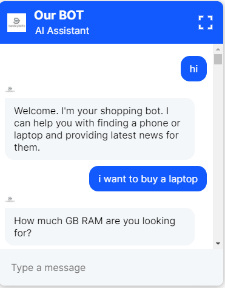
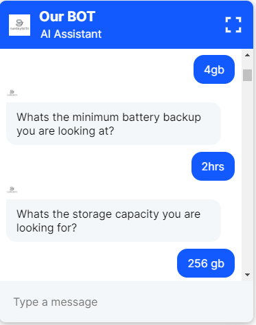
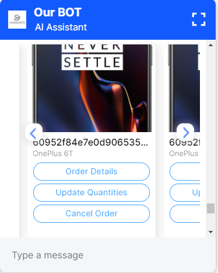

## [RASA CHATBOT]

## Tech Stack
- Python
- Rasa
- Node js
- Gensim

## Chatbot Features
- Chatbot was made for use on ecommerce platforms.
- It could you help you with buying electronics products like laptops or mobile phones by asking a series of specifications and then retrieving the results from the database.
- It could help you alter orders by changing their delivery address, quantity or by cancelling it.
- It could engage in a limited conversation with you.

## Training
- Rasa Framework was used for creating the chatbot. 
- Word2Vec model was trained on comments scrapped from certain websites.
-

## SCREENSHOTS

